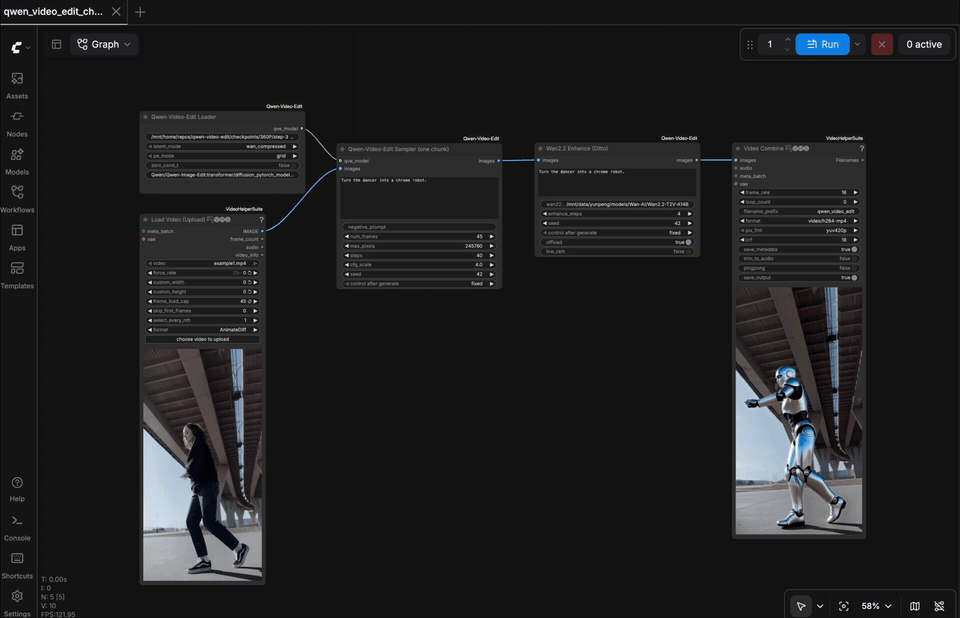

# Instruction-Based Video Editing by Repurposing an Image Editing Model

**[Yunpeng Bai](https://yunpeng1998.github.io/), Yossi Gandelsman, Michaël Gharbi, Qixing Huang**

### 🔗 Links & Resources

[[📄 Paper](https://arxiv.org/abs/2608.14790)] [[🌐 Project Page](https://yunpeng1998.github.io/Qwen-Video-Edit-Page)] [[🤗 Model (Hugging Face)](https://huggingface.co/yunpeng1998/Qwen-Video-Edit)] [[🔮 Model (ModelScope)](https://modelscope.cn/models/yunpeng1998/Qwen-Video-Edit)]
<!-- TODO: replace the Paper link with the arXiv URL once available -->

---


*A long video edited chunk by chunk with different instructions — source on the
left, our result on the right. Full-quality videos play on the
[project page](https://yunpeng1998.github.io/Qwen-Video-Edit-Page/).*

## 🔥 Updates

- **2026-08-20**: New checkpoints in the [model zoo](#model-zoo): **480P**
  (per-subset variants + an **81-frame** model) and **720P**. Added
  **ComfyUI support** — this repo now doubles as a
  [custom-node pack](#comfyui).
- **2026-08-14**: Initial release: code, the 360P checkpoint, report, and
  project page.

Instruction-based **video editing by repurposing an image editing model**:
Qwen-Image-Edit's DiT directly edits Wan 2.1 video-VAE latents, bridged by
two tiny trainable projections warm-started from the DiT's own input/output
layers. No video-pretrained transformer required.

```
source video ──(frozen Wan2.1 VAE)──> video latents (16ch, temporal 4x)
      │                                       │
      │                              trainable in-projection
      │                                       ▼
prompt + frame-grid preview ──> Qwen-Image-Edit DiT (LoRA or full FT)
   (Qwen2.5-VL branch)                        │  grid RoPE over latent frames
                                     trainable out-projection
                                              ▼
                       edited latents ──(frozen Wan2.1 VAE)──> edited video
                                              │
                       (optional) Wan2.2 denoising-enhancement (Ditto)
```

Key ideas:
- **Warm-started projections**: input = `Conv3d(16→D, k=(1,2,2))` initialized
  from the DiT's `img_in` (mathematically exact — a static video is embedded
  identically to a Qwen image); output initialized from `proj_out`. The
  model edits video tokens from step 0 and training only learns the
  distribution shift.
- **Grid positional encoding**: the T latent frames are laid out as tiles of
  one virtual big image (each frame keeps a spatial offset), matching the
  image model's prior. Implemented as a runtime patch of DiffSynth's
  `QwenEmbedRope` (`rope_patch.py`) — no vendored model code.

## Repository layout

| file | purpose |
|---|---|
| `projections.py` | trainable in/out projections + warm-start init |
| `dataset.py` | Ditto-format (source, edited, instruction) video pairs |
| `model.py` | video-token model_fn + training module |
| `train.py` | single-node multi-GPU training (torchrun) |
| `infer.py` | long-video editing + Wan2.2 enhancement pipeline |
| `empirical.py` | zero-training demos: image-grid & latent-grid editing |
| `diffsynth/` | **vendored** [DiffSynth-Studio](https://github.com/modelscope/DiffSynth-Studio) (pinned snapshot; `models/qwen_image_dit.py` carries our grid RoPE patch) |
| `wan/` | **vendored** Wan2.2 enhancement code from [Ditto](https://github.com/EzioBy/Ditto) (with an SDPA fallback so flash-attn is optional) |
| `rope_patch.py` | guard that verifies the vendored patched diffsynth is the one imported |
| `licenses/` | upstream licenses for the vendored code |


## Setup

Python 3.10–3.12 with a CUDA build of PyTorch. Create a fresh environment
(either flavor):

```bash
# option A: conda
conda create -n qwen-video-edit python=3.12 -y
conda activate qwen-video-edit

# option B: venv
python3.12 -m venv ./envs/qwen-video-edit
source ./envs/qwen-video-edit/bin/activate
```

Then install the dependencies and set the base-weight cache location:

```bash
pip install -r requirements.txt
export DIFFSYNTH_MODEL_BASE_PATH=/path/to/model_cache   # add to your shell rc for persistence
```

Verify the environment (should print your torch version with
`cuda available: True`, and confirm the vendored patched DiffSynth is the
one being imported):

```bash
python -c "import torch; print(torch.__version__, 'cuda available:', torch.cuda.is_available())"
python -c "import rope_patch; rope_patch.apply(); print('vendored diffsynth OK')"
```

Note: run all commands from the repo root -- the vendored `diffsynth/` and
`wan/` packages must shadow any pip-installed copies (the second check above
fails loudly if they don't).

### Model zoo

All fine-tuned checkpoints live on
[🤗 Hugging Face](https://huggingface.co/yunpeng1998/Qwen-Video-Edit); the two
⭐ recommended ones plus 720P are mirrored on
[🔮 ModelScope](https://modelscope.cn/models/yunpeng1998/Qwen-Video-Edit)
(same paths). Directory names encode the [Ditto-1M](https://github.com/EzioBy/Ditto)
training subset and the supported frame count: e.g. `global_local_81` = trained
on the *global + local* editing subsets, supports **81**-frame chunks
(`_45` → 45 frames). At inference, `--num_frames` and `--video_max_pixels`
**must match the table** (all checkpoints use
`--latent_mode wan_compressed --pe_mode grid`):

| checkpoint | training data (Ditto-1M) | `--num_frames` | `--video_max_pixels` | download |
|---|---|---|---|---|
| **[`360P/step-30000`](https://huggingface.co/yunpeng1998/Qwen-Video-Edit/tree/main/360P) ⭐ (Recommended)** | global + local | **45** | **245760** | [HF](https://huggingface.co/yunpeng1998/Qwen-Video-Edit/tree/main/360P) / [MS](https://modelscope.cn/models/yunpeng1998/Qwen-Video-Edit/files) |
| [`480P/global_45/step-6000`](https://huggingface.co/yunpeng1998/Qwen-Video-Edit/tree/main/480P/global_45) | global | 45 | 399360 | [HF](https://huggingface.co/yunpeng1998/Qwen-Video-Edit/tree/main/480P/global_45) |
| [`480P/local_45/step-11000`](https://huggingface.co/yunpeng1998/Qwen-Video-Edit/tree/main/480P/local_45) | local | 45 | 399360 | [HF](https://huggingface.co/yunpeng1998/Qwen-Video-Edit/tree/main/480P/local_45) |
| [`480P/sim2real_45/step-7000`](https://huggingface.co/yunpeng1998/Qwen-Video-Edit/tree/main/480P/sim2real_45) | sim2real | 45 | 399360 | [HF](https://huggingface.co/yunpeng1998/Qwen-Video-Edit/tree/main/480P/sim2real_45) |
| **[`480P/global_local_81/step-6500`](https://huggingface.co/yunpeng1998/Qwen-Video-Edit/tree/main/480P/global_local_81) ⭐ (Recommended)** | global + local | **81** | **399360** | [HF](https://huggingface.co/yunpeng1998/Qwen-Video-Edit/tree/main/480P/global_local_81) / [MS](https://modelscope.cn/models/yunpeng1998/Qwen-Video-Edit/files) |
| [`720P/global_local_45/step-3500`](https://huggingface.co/yunpeng1998/Qwen-Video-Edit/tree/main/720P/global_local_45) | global + local | 45 | 921600 | [HF](https://huggingface.co/yunpeng1998/Qwen-Video-Edit/tree/main/720P/global_local_45) / [MS](https://modelscope.cn/models/yunpeng1998/Qwen-Video-Edit/files) |

> **Which one to use?** Start with the two ⭐ recommended checkpoints: they
> are trained on the full *global + local* data and are the most converged.
> **`360P/step-30000`** gives the best quality-per-compute and is the safest
> default; **`480P/global_local_81`** is the pick for higher resolution or
> longer (81-frame) chunks. The per-subset 480P variants (`global_45` /
> `local_45` / `sim2real_45`) specialize in one edit family each.
>
> **Note on 720P**: trained for only 3,500 steps so far (720P training is
> slow — ~4x the tokens per sample of 480P). It is the least-trained
> checkpoint in the zoo; if results look off, fall back to a 480P/360P
> model, which also runs much faster at inference.

Download any of them the same way (each file is ~40GB):

```bash
# the default 360P checkpoint used in the examples below:
hf download yunpeng1998/Qwen-Video-Edit 360P/step-30000.safetensors \
  --local-dir ./checkpoints
# -> ./checkpoints/360P/step-30000.safetensors

# e.g. the 81-frame 480P checkpoint:
hf download yunpeng1998/Qwen-Video-Edit 480P/global_local_81/step-6500.safetensors \
  --local-dir ./checkpoints

# or from ModelScope (mirrored checkpoints only, same paths):
modelscope download --model yunpeng1998/Qwen-Video-Edit \
  360P/step-30000.safetensors --local_dir ./checkpoints
```

**Base weights.** Easiest: do nothing — DiffSynth's loader auto-downloads
them (ModelScope) into `DIFFSYNTH_MODEL_BASE_PATH` on first run. To
pre-download from Hugging Face instead (same directory layout, only the
needed subfolders):

```bash
# Qwen-Image-Edit DiT (~40GB)
hf download Qwen/Qwen-Image-Edit --include "transformer/*" \
  --local-dir $DIFFSYNTH_MODEL_BASE_PATH/Qwen/Qwen-Image-Edit

# Qwen text encoder (~15GB) + image VAE + tokenizer
hf download Qwen/Qwen-Image --include "text_encoder/*" "vae/*" "tokenizer/*" \
  --local-dir $DIFFSYNTH_MODEL_BASE_PATH/Qwen/Qwen-Image

# Qwen-Image-Edit processor (VL image preprocessing config)
hf download Qwen/Qwen-Image-Edit --include "processor/*" \
  --local-dir $DIFFSYNTH_MODEL_BASE_PATH/Qwen/Qwen-Image-Edit

# Wan 2.1 video VAE (the latent space the DiT edits in)
hf download Wan-AI/Wan2.1-T2V-1.3B --include "Wan2.1_VAE.pth" \
  --local-dir $DIFFSYNTH_MODEL_BASE_PATH/Wan-AI/Wan2.1-T2V-1.3B

# Wan 2.2 (enhancement stage, ~80GB)
hf download Wan-AI/Wan2.2-T2V-A14B \
  --local-dir /models/Wan-AI/Wan2.2-T2V-A14B
```

With everything pre-downloaded you can set `DIFFSYNTH_SKIP_DOWNLOAD=true` to
keep the loader fully offline.

## Inference (long video, one prompt per chunk + enhancement)

The pipeline has two stages that run sequentially on one GPU, chained **in
memory** (no intermediate un-enhanced files): (1) each line of `prompts.txt`
edits one `num_frames` window of the source video, in order, stopping when
prompts or frames run out; (2) every edited chunk is refined by Wan2.2
denoising-enhancement (re-noise a few steps, denoise with Wan2.2 -- the
[Ditto](https://github.com/EzioBy/Ditto) recipe). Wan2.2 uses the *same*
Wan2.1 VAE as the editing model.

```bash
python infer.py \
  --source_video ./examples/example1.mp4 --prompts_file ./examples/prompts.txt \
  --checkpoint ./checkpoints/360P/step-30000.safetensors \
  --wan22_ckpt_dir /models/Wan-AI/Wan2.2-T2V-A14B \
  --num_frames 45 --video_max_pixels 245760 \
  --output_dir ./out
```

`--latent_mode / --pe_mode / --num_frames` **must match the
checkpoint's training configuration**. Outputs `*_chunk000.mp4` (+ same-name
`.txt` with the prompt) in temporal order; the script prints the ffmpeg
concat command. `--skip_enhance` writes the raw edited chunks (debugging
only). flash-attn speeds up the enhancement stage but is optional (the
vendored attention has an SDPA fallback).

## ComfyUI

This repo doubles as a ComfyUI custom-node pack (single-chunk semantics:
one sampler call edits one `num_frames` window).



### Install

```bash
# 1. ComfyUI itself (skip if you already have it)
git clone https://github.com/comfyanonymous/ComfyUI
cd ComfyUI && pip install -r requirements.txt
# NOTE: make sure this doesn't replace your torch/torchvision/torchaudio with
# builds for a different CUDA version -- if imports break afterwards,
# reinstall the matching wheels from https://download.pytorch.org/whl/<your-cuda>

# 2. Node packs
cd custom_nodes
git clone https://github.com/yunpeng1998/Qwen-Video-Edit
cd Qwen-Video-Edit && pip install -r requirements.txt && cd ..   # our deps
# video I/O nodes (LoadVideo / VideoCombine):
git clone https://github.com/Kosinkadink/ComfyUI-VideoHelperSuite
cd ComfyUI-VideoHelperSuite && pip install -r requirements.txt && cd ..
```

### Prepare models & inputs

```bash
# where the Qwen/Wan base weights get auto-downloaded on first run
# (~55GB -- point it at a big disk; reuse your existing cache if you have one)
export DIFFSYNTH_MODEL_BASE_PATH=/path/to/model_cache

# a fine-tuned checkpoint from the model zoo (see table above)
hf download yunpeng1998/Qwen-Video-Edit 360P/step-30000.safetensors \
  --local-dir /path/to/checkpoints

# Wan2.2 for the enhancement stage
hf download Wan-AI/Wan2.2-T2V-A14B --local-dir /path/to/Wan2.2-T2V-A14B

# put a test video where the LoadVideo node can see it
cp your_video.mp4 ComfyUI/input/
```

### Run

```bash
cd ComfyUI    # (the directory containing main.py)
python main.py --listen 0.0.0.0 --port 8188
```

Open `http://localhost:8188`. On a local machine that's it; on a remote
server, tunnel the port first: `ssh -L 8188:localhost:8188 user@server`,
then open `localhost:8188` locally.

Load the example workflow: sidebar **Workflows** tab after
`cp custom_nodes/Qwen-Video-Edit/comfyui_workflows/qwen_video_edit_chunk.json user/default/workflows/`,
or just drag the JSON onto the canvas. Set the Loader's `checkpoint` and the
Enhance node's `wan22_ckpt_dir` to your paths, pick your video in LoadVideo
(set `frame_load_cap` = the sampler's `num_frames`), write a prompt (same
text in Sampler and Enhance), and Queue. The first run downloads/loads
~55GB of base weights -- watch the terminal for progress.

Three nodes under the **QwenVideoEdit** category:

| node | role | key widgets |
|---|---|---|
| `Qwen-Video-Edit Loader` | loads DiT + text encoder + VAE + your checkpoint | `checkpoint`, `latent_mode` / `pe_mode` / `zero_cond_t` (**must match the checkpoint**) |
| `Qwen-Video-Edit Sampler (one chunk)` | edits one chunk of frames | `prompt`, `num_frames`, `max_pixels`, `steps`, `cfg_scale`, `seed` |
| `Wan2.2 Enhance (Ditto)` | mandatory denoising enhancement | `wan22_ckpt_dir`, `enhance_steps`, `offload` |

Switching between checkpoints trained at different resolutions = duplicate
the Loader with a different `checkpoint`, and set the Sampler's
`max_pixels` / `num_frames` per the [model zoo](#model-zoo) table.
For long videos, chunk with VHS LoadVideo's `frame_load_cap` /
`skip_first_frames` and run per chunk.

**Memory.** The editing stack (~55GB) and the Wan2.2 expert (~28GB) cannot
share an 80GB GPU, so the sampler and the enhance node automatically swap
them: by default the idle stack is parked in CPU RAM (fast, needs ~100GB
host RAM). On smaller hosts set `low_ram=True` on the enhance node -- the
editing stack is then fully freed before enhancing and reloaded from disk
(~minutes) on the next sampler run.

## Training

Data: the [Ditto-1M dataset](https://github.com/EzioBy/Ditto) —
(source video, edited video, instruction) triplets. Download per their
instructions so you have `videos/` and metadata JSONs (lists of
`{"source_path", "edited_path", "instruction"}` relative to the video root).

```bash
torchrun --nproc_per_node=8 train.py \
  --meta_paths /data/ditto/metadata/training_metadata/global.json \
  --video_root /data/ditto/videos \
  --num_frames 45 --video_max_pixels 245760 \
  --lora_base_model dit --lora_rank 32 \
  --lora_target_modules "to_q,to_k,to_v,add_q_proj,add_k_proj,add_v_proj,to_out.0,to_add_out,img_mlp.net.2,img_mod.1,txt_mlp.net.2,txt_mod.1" \
  --learning_rate 1e-4 \
  --output_path ./checkpoints --save_steps 1000
```

- **Full fine-tuning**: replace the `--lora_*` flags with
  `--trainable_models dit --learning_rate 1e-5` (ZeRO-2 + CPU optimizer
  offload engages automatically; add `--zero_stage 3` to also shard
  parameters — needed for long sequences, e.g. 81-frame 720p).
- Higher resolution / more frames: `--num_frames 81 --video_max_pixels 921600`
  with `--zero_stage 3 --use_gradient_checkpointing_offload`.
- Checkpoints are trainable-weights-only `.safetensors`, loadable directly by
  `infer.py --checkpoint`. Resume weights with `--resume_from_checkpoint`.

## Empirical demos (no training needed)

The observations this project is built on, runnable with stock checkpoints:

```bash
# 1. An image edit model can edit "video as a contact sheet":
python empirical.py --mode image_grid --frames_dir ./snowboard --uniform_sample \
  --prompt "Replace the skier on the image with a robot, ensuring the pose matches the original person, and maintaining consistency of the robot across frames."

# 2. The same works when each frame is VAE-encoded SEPARATELY and the DiT
#    sees concatenated per-frame tokens with grid positional encodings
python empirical.py --mode latent_grid --frames_dir ./snowboard --uniform_sample \
  --prompt "Replace the skier on the image with a robot, ensuring the pose matches the original person, and maintaining consistency of the robot across frames."
```

Input (`input_grid.png`) and result (`edited_grid.png`), zero training:

<p align="center">
  
  
</p>

`--frames_dir` holds rows×cols (default 9) frames sorted by filename.

## License / acknowledgements

Built on [DiffSynth-Studio](https://github.com/modelscope/DiffSynth-Studio),
[Qwen-Image-Edit](https://huggingface.co/Qwen/Qwen-Image-Edit),
[Wan 2.1/2.2](https://github.com/Wan-Video) and
[Ditto](https://github.com/EzioBy/Ditto). Vendored code retains its upstream
licenses -- see `licenses/LICENSE.diffsynth-studio` and
`licenses/LICENSE.ditto`. 