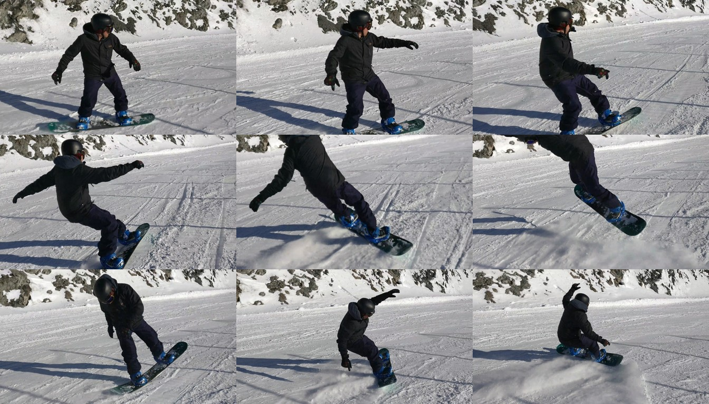
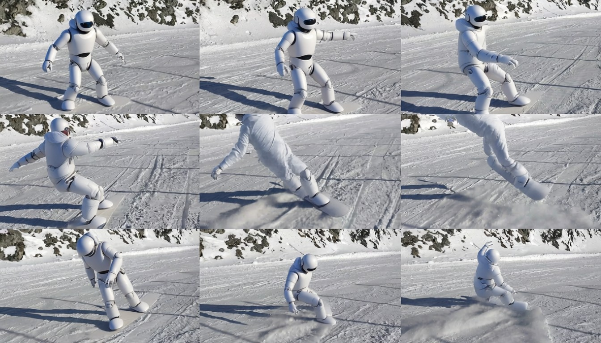

# Qwen-Video-Edit: Instruction-Based Video Editing by Repurposing an Image Editing Model

**Yunpeng Bai, Yossi Gandelsman, Michaël Gharbi, Qixing Huang**

### 🔗 Links & Resources

[[📄 Paper](#)] [[🌐 Project Page](https://yunpeng1998.github.io/Qwen-Video-Edit-Page)] [[📦 Model Weights](https://huggingface.co/yunpeng1998/Qwen-Video-Edit)]
<!-- TODO: replace the Paper link with the arXiv URL once available -->

---


*A long video edited chunk by chunk with different instructions — source on the
left, our result on the right. Full-quality videos play on the
[project page](https://yunpeng1998.github.io/qwen-video-edit/).*

Instruction-based **video editing by repurposing an image editing model**:
Qwen-Image-Edit's DiT directly edits Wan 2.1 video-VAE latents, bridged by
two tiny trainable projections warm-started from the DiT's own input/output
layers. No video-pretrained transformer required.

```
source video ──(frozen Wan2.1 VAE)──> video latents (16ch, temporal 4x)
      │                                       │
      │                              trainable in-projection
      │                                       ▼
prompt + frame-grid preview ──> Qwen-Image-Edit DiT (LoRA or full FT)
   (Qwen2.5-VL branch)                        │  grid/video RoPE over latent frames
                                     trainable out-projection
                                              ▼
                       edited latents ──(frozen Wan2.1 VAE)──> edited video
                                              │
                       (optional) Wan2.2 denoising-enhancement (Ditto)
```

Key ideas:
- **Warm-started projections**: input = `Conv3d(16→D, k=(1,2,2))` initialized
  from the DiT's `img_in` (mathematically exact — a static video is embedded
  identically to a Qwen image); output initialized from `proj_out`. The
  model edits video tokens from step 0 and training only learns the
  distribution shift.
- **Grid positional encoding**: the T latent frames are laid out as tiles of
  one virtual big image (each frame keeps a spatial offset), matching the
  image model's prior; `--pe_mode video` alternatively gives each frame an
  explicit temporal index. Implemented as a runtime patch of DiffSynth's
  `QwenEmbedRope` (`rope_patch.py`) — no vendored model code.
- Two latent modes: `wan_compressed` (default; Wan's temporal-4x latents) and
  `qwen_framewise_pack4` (per-frame Qwen image latents, 4 frames packed along
  the feature dim; same token count, motion becomes slot differences).

## Repository layout

| file | purpose |
|---|---|
| `projections.py` | trainable in/out projections + warm-start init |
| `dataset.py` | Ditto-format (source, edited, instruction) video pairs |
| `model.py` | video-token model_fn + training module |
| `train.py` | single-node multi-GPU training (torchrun) |
| `infer.py` | long-video editing + Wan2.2 enhancement pipeline |
| `empirical.py` | zero-training demos: image-grid & latent-grid editing |
| `diffsynth/` | **vendored** [DiffSynth-Studio](https://github.com/modelscope/DiffSynth-Studio) (pinned snapshot; `models/qwen_image_dit.py` carries our grid/video RoPE patch) |
| `wan/` | **vendored** Wan2.2 enhancement code from [Ditto](https://github.com/EzioBy/Ditto) (with an SDPA fallback so flash-attn is optional) |
| `rope_patch.py` | guard that verifies the vendored patched diffsynth is the one imported |
| `licenses/` | upstream licenses for the vendored code |

DiffSynth-Studio and the enhancement code are vendored on purpose: both are
fast-moving repos, and this project depends on their exact internals. Do NOT
pip-install either -- run all scripts from the repo root so the vendored
packages shadow any installed copies.

## Setup

Python 3.10–3.12 with a CUDA build of PyTorch. Create a fresh environment
(either flavor):

```bash
# option A: conda
conda create -n qwen-video-edit python=3.12 -y
conda activate qwen-video-edit

# option B: venv
python3.12 -m venv ./envs/qwen-video-edit
source ./envs/qwen-video-edit/bin/activate
```

Then install the dependencies and set the base-weight cache location:

```bash
pip install -r requirements.txt
export DIFFSYNTH_MODEL_BASE_PATH=/path/to/model_cache   # add to your shell rc for persistence
```

Verify the environment (should print your torch version with
`cuda available: True`, and confirm the vendored patched DiffSynth is the
one being imported):

```bash
python -c "import torch; print(torch.__version__, 'cuda available:', torch.cuda.is_available())"
python -c "import rope_patch; rope_patch.apply(); print('vendored diffsynth OK')"
```

Note: run all commands from the repo root -- the vendored `diffsynth/` and
`wan/` packages must shadow any pip-installed copies (the second check above
fails loudly if they don't).

### Download checkpoints

**Our fine-tuned editing checkpoint** (360p; trained with `--num_frames 45
--video_max_pixels 245760 --latent_mode wan_compressed --pe_mode grid
--zero_cond_t` — inference flags must match):

```bash
hf download yunpeng1998/Qwen-Video-Edit 360P/step-30000.safetensors \
  --local-dir ./checkpoints
# -> ./checkpoints/360P/step-30000.safetensors
```

**Base weights.** Easiest: do nothing — DiffSynth's loader auto-downloads
them (ModelScope) into `DIFFSYNTH_MODEL_BASE_PATH` on first run. To
pre-download from Hugging Face instead (same directory layout, only the
needed subfolders):

```bash
# Qwen-Image-Edit DiT (~40GB)
hf download Qwen/Qwen-Image-Edit --include "transformer/*" \
  --local-dir $DIFFSYNTH_MODEL_BASE_PATH/Qwen/Qwen-Image-Edit

# Qwen text encoder (~15GB) + image VAE + tokenizer
hf download Qwen/Qwen-Image --include "text_encoder/*" "vae/*" "tokenizer/*" \
  --local-dir $DIFFSYNTH_MODEL_BASE_PATH/Qwen/Qwen-Image

# Qwen-Image-Edit processor (VL image preprocessing config)
hf download Qwen/Qwen-Image-Edit --include "processor/*" \
  --local-dir $DIFFSYNTH_MODEL_BASE_PATH/Qwen/Qwen-Image-Edit

# Wan 2.1 video VAE (the latent space the DiT edits in)
hf download Wan-AI/Wan2.1-T2V-1.3B --include "Wan2.1_VAE.pth" \
  --local-dir $DIFFSYNTH_MODEL_BASE_PATH/Wan-AI/Wan2.1-T2V-1.3B

# Wan 2.2 (enhancement stage, ~80GB)
hf download Wan-AI/Wan2.2-T2V-A14B \
  --local-dir /models/Wan-AI/Wan2.2-T2V-A14B
```

With everything pre-downloaded you can set `DIFFSYNTH_SKIP_DOWNLOAD=true` to
keep the loader fully offline.

## Inference (long video, one prompt per chunk + enhancement)

The pipeline has two stages that run sequentially on one GPU, chained **in
memory** (no intermediate un-enhanced files): (1) each line of `prompts.txt`
edits one `num_frames` window of the source video, in order, stopping when
prompts or frames run out; (2) every edited chunk is refined by Wan2.2
denoising-enhancement (re-noise a few steps, denoise with Wan2.2 -- the
[Ditto](https://github.com/EzioBy/Ditto) recipe). Wan2.2 uses the *same*
Wan2.1 VAE as the editing model.

```bash
python infer.py \
  --source_video ./examples/example1.mp4 --prompts_file ./examples/prompts.txt \
  --checkpoint ./checkpoints/360P/step-30000.safetensors \
  --wan22_ckpt_dir /models/Wan-AI/Wan2.2-T2V-A14B \
  --num_frames 45 --video_max_pixels 245760 \
  --output_dir ./out
```

`--latent_mode / --pe_mode / --num_frames / --zero_cond_t` **must match the
checkpoint's training configuration**. Outputs `*_chunk000.mp4` (+ same-name
`.txt` with the prompt) in temporal order; the script prints the ffmpeg
concat command. `--skip_enhance` writes the raw edited chunks (debugging
only). flash-attn speeds up the enhancement stage but is optional (the
vendored attention has an SDPA fallback).

## Training

Data: the [Ditto-1M dataset](https://github.com/EzioBy/Ditto) —
(source video, edited video, instruction) triplets. Download per their
instructions so you have `videos/` and metadata JSONs (lists of
`{"source_path", "edited_path", "instruction"}` relative to the video root).

```bash
torchrun --nproc_per_node=8 train.py \
  --meta_paths /data/ditto/metadata/training_metadata/global.json \
  --video_root /data/ditto/videos \
  --num_frames 45 --video_max_pixels 245760 \
  --lora_base_model dit --lora_rank 32 \
  --lora_target_modules "to_q,to_k,to_v,add_q_proj,add_k_proj,add_v_proj,to_out.0,to_add_out,img_mlp.net.2,img_mod.1,txt_mlp.net.2,txt_mod.1" \
  --learning_rate 1e-4 \
  --output_path ./checkpoints --save_steps 1000
```

- **Full fine-tuning**: replace the `--lora_*` flags with
  `--trainable_models dit --learning_rate 1e-5` (ZeRO-2 + CPU optimizer
  offload engages automatically; add `--zero_stage 3` to also shard
  parameters — needed for long sequences, e.g. 81-frame 720p).
- Higher resolution / more frames: `--num_frames 81 --video_max_pixels 921600`
  with `--zero_stage 3 --use_gradient_checkpointing_offload`.
- Checkpoints are trainable-weights-only `.safetensors`, loadable directly by
  `infer.py --checkpoint`. Resume weights with `--resume_from_checkpoint`.

## Empirical demos (no training needed)

The observations this project is built on, runnable with stock checkpoints:

```bash
# 1. An image edit model can edit "video as a contact sheet":
python empirical.py --mode image_grid --frames_dir ./snowboard --uniform_sample \
  --prompt "Replace the skiers on the image with a robot, ensuring the pose matches the original person, and maintaining consistency of the robot across frames."

# 2. The same works when each frame is VAE-encoded SEPARATELY and the DiT
#    sees concatenated per-frame tokens with grid positional encodings
#    (identity projections = exact img_in/proj_out warm start):
python empirical.py --mode latent_grid --frames_dir ./snowboard --uniform_sample \
  --prompt "Replace the skiers on the image with a robot, ensuring the pose matches the original person, and maintaining consistency of the robot across frames."
```

Input (`input_grid.png`) and result (`edited_grid.png`), zero training:

<p align="center">
  
  
</p>

`--frames_dir` holds rows×cols (default 9) frames sorted by filename.

## License / acknowledgements

Built on [DiffSynth-Studio](https://github.com/modelscope/DiffSynth-Studio),
[Qwen-Image-Edit](https://huggingface.co/Qwen/Qwen-Image-Edit-2511),
[Wan 2.1/2.2](https://github.com/Wan-Video) and
[Ditto](https://github.com/EzioBy/Ditto). Vendored code retains its upstream
licenses -- see `licenses/LICENSE.diffsynth-studio` and
`licenses/LICENSE.ditto`. 